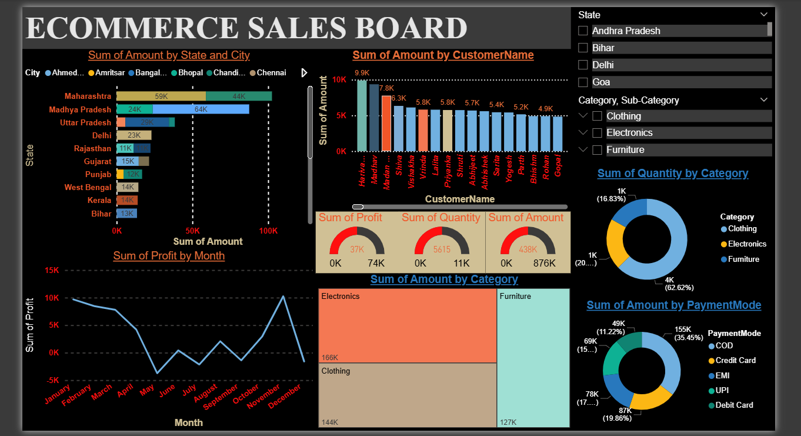

# 🛒 E-Commerce Sales Dashboard

## 📌 Overview

This repository contains a comprehensive Power BI dashboard designed to analyze and visualize e-commerce sales performance. The **ECOMMERCE SALES BOARD.pbix** file provides actionable insights into revenue streams, customer purchasing behavior, and product performance, enabling data-driven decision-making for retail operations.

## 📊 Key Features

- **Sales Performance Tracking:** High-level KPIs tracking Total Revenue, Profit Margins, and Total Orders.
- **Trend Analysis:** Time-series visualizations showing sales growth over different quarters and months.
- **Product Insights:** Breakdown of top-performing categories, sub-categories, and individual products.
- **Geospatial Analysis:** Regional performance mapping to identify top-selling locations.
- **Interactive Filtering:** Slicers for dates, product categories, and regions to allow users to drill down into specific data segments.

## 🛠️ Tools & Technologies Used

- **Power BI Desktop:** For data modeling, DAX measure creation, and data visualization.
- **Theme:** Built-in "Innovate" theme applied for a clean, professional aesthetic.
- **[Insert Data Source]:** (e.g., Excel, SQL Server, Kaggle Dataset) used as the primary data repository.

## 🚀 How to Use This Dashboard

1. **Download Power BI Desktop:** If you don't have it installed, download it for free from the [Microsoft Store](https://powerbi.microsoft.com/desktop/).
2. **Clone or Download the Repository:** Download the `ECOMMERCE SALES BOARD.pbix` file to your local machine.
3. **Open the File:** Double-click the `.pbix` file to open it in Power BI Desktop.
4. **Interact:** Use the built-in slicers and cross-filtering capabilities by clicking on different chart elements to explore the data.

## 📸 Dashboard Snapshot

## 💡 Key Insights (Example)

- **[Insight 1]:** e.g., "Q4 drove 45% of total annual revenue, heavily influenced by holiday promotions."
- **[Insight 2]:** e.g., "The 'Electronics' category holds the highest profit margin at 22%."
- **[Insight 3]:** e.g., "Customer retention rates showed a 5% increase following the loyalty program launch in August."

## 🤝 Contributing

Feedback and suggestions are welcome! Feel free to open an issue or submit a pull request if you have ideas on how to improve the data model or visualizations.

## 📄 License

[Insert License Type, e.g., MIT License] - feel free to use and modify for your own learning!

